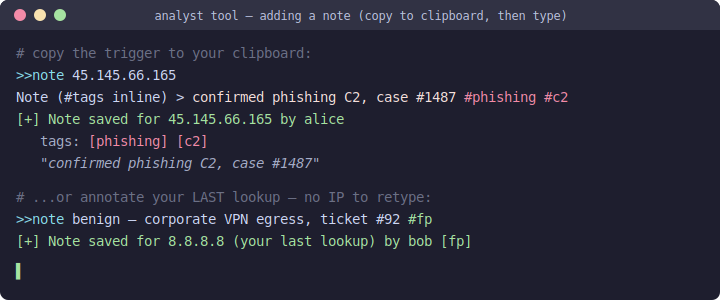

# Notes & Tags — Command Reference

The Analyst Tool lets your team attach **shared notes and tags** to indicators.
A note an analyst saves shows up automatically at the top of everyone's next
lookup of that indicator (on the shared remote database) or your own next lookup
(on a local database).

Looking things up stays exactly as it is — you copy an indicator and the report
appears. Notes are the one thing you *create*, so they use a small command
convention: a clipboard line that starts with the **command prefix** (`>>` by
default) is treated as a command, never as an indicator.

You can enter notes three ways — pick whichever is comfortable:

1. **Trigger, then type** (recommended) — copy a short `>>note <indicator>` line; the
   tool prompts and you type the note inline.
2. **One-shot clipboard line** — copy the whole `>>note <indicator> <text>` at once.
3. **Command line** — `python annotate.py …`, no clipboard at all.

> Notes require the cache to be enabled (`[CACHE] enabled = true`). With the
> remote PostgreSQL backend they're shared across the whole team automatically.

---

## Quick reference

| Command | What it does |
|---------|--------------|
| `>>note <indicator> <text>` | Add a note to a specific indicator |
| `>>note <indicator>` | Add a note — the tool prompts you to type it |
| `>>note <text>` | Add a note to your **last** lookup (no indicator to retype) |
| `>>note` | Prompt for a note on your **last** lookup |
| `>>tag <indicator> <tag1> <tag2>` | Add tags only (no note text) |
| `>>note-rm <indicator>` | Remove **your** notes for an indicator |
| `python annotate.py add <indicator> "<text>" [--tags a,b]` | Add a note via CLI |
| `python annotate.py list <indicator>` | Show notes via CLI |
| `python annotate.py rm <indicator>` | Remove your notes via CLI |
| `>>exclude <domain>` | Add a domain to the **shared** skip list (anyone can remove) |
| `>>exclude` | Exclude the host of your **last** domain/URL lookup |
| `>>exclude-rm <domain>` | Remove a domain from the shared skip list |
| `>>exclude-list` | Show the shared exclusion list |
| `python annotate.py exclude add/list/rm <domain>` | Manage exclusions via CLI |

`<indicator>` is an IP, hash, domain, or URL. Tags are written inline as
`#tag` inside a note, or as bare words with `>>tag`.

---

## 1. Trigger, then type (recommended)

Copy just the trigger to your clipboard:

```
>>note 45.145.66.165
```

The tool prompts; you type the note (with optional inline `#tags`) and press enter:



This is the easiest path: you only put a short, fixed string on the clipboard, and
the free text is typed directly — no "compose it somewhere then copy" step.

To annotate the indicator you **just looked up**, copy the bare trigger:

```
>>note
Note (#tags inline) > looks like a benign corporate VPN egress #fp
[+] Note saved for 8.8.8.8 (your last lookup) by alice
    tags: [fp]
```

---

## 2. One-shot clipboard line

If you already have the text, put the whole command on the clipboard at once:

```
>>note 45.145.66.165 confirmed phishing C2, case #1487 #phishing #c2
```

Or attach to your last lookup by omitting the indicator (the first word isn't an
indicator, so it's treated as the note):

```
>>note benign — corporate VPN egress, ticket #92 #fp
```

---

## 3. Tags

Two ways to tag:

- **Inline in a note** — any `#word` that starts with a letter becomes a tag, e.g.
  `#phishing`, `#c2`. A `#` followed by digits is left alone, so `case #1487`
  stays part of the note text, not a tag.
- **Tags only** — `>>tag` adds tags without a note:

  ```
  >>tag 45.145.66.165 phishing c2 confirmed
  [+] Note saved for 45.145.66.165 by alice
      tags: [phishing] [c2] [confirmed]
  ```

Tags are colour-coded when shown: `phishing` / `c2` / `malware` / `ransomware`
and similar render red, `fp` / `benign` / `clean` / `internal` render green, and
anything else is neutral cyan.

---

## 4. How notes appear on a lookup

When you look up an indicator that has notes, a **TEAM NOTES** block prints at the
very top of the report — above the multi-user notice and the verdict — newest
first:


If there are more notes than `max_notes_shown` (default 5), the block ends with a
`(+N more)` line.

---

## 5. Removing notes

You can remove **your own** notes for an indicator (you can't delete a teammate's):

```
>>note-rm 45.145.66.165
[+] Removed 1 of your note(s) for 45.145.66.165
```

Or via the CLI: `python annotate.py rm 45.145.66.165`.

---

## 6. The CLI (`annotate.py`)

For bulk or scripted entry, or if you'd rather not use the clipboard for free text:

```bash
# Add a note with tags
python annotate.py add 45.145.66.165 "confirmed phishing C2, case #1487" --tags phishing,c2

# List notes
python annotate.py list 45.145.66.165

# Remove your notes
python annotate.py rm 45.145.66.165
```

It writes to the same database the main tool uses, so notes show up on everyone's
next lookup either way. The author is recorded as your `[CACHE] user`, or your OS
login name if that's blank.

---

## 7. Shared domain exclusions

The tool skips lookups for domains you don't want reported (e.g. a reference link
it printed, or an internal portal). There are two layers:

- **Local** — your `config.ini [EXCLUSIONS] domains` list (pre-filled with the
  tool's own reference-link domains). Always applies, per machine.
- **Shared** — a list stored in the cache database. On the **remote** backend
  it's team-wide: anyone can add or remove, and changes propagate to everyone
  within `exclusion_refresh_minutes` (default 5) without restarting.

The effective skip list is the union of both.

```
>>exclude www.ultimatewindowssecurity.com   add a domain (subdomains match too)
>>exclude                                    exclude the host of your last lookup
>>exclude-rm speedguide.net                  remove one (anyone may remove)
>>exclude-list                               show the shared list
```

Each entry records who added it and when. The same actions are available from the
CLI for bulk/scripted use:

```bash
python annotate.py exclude add internal.portal.corp.com
python annotate.py exclude list
python annotate.py exclude rm internal.portal.corp.com
```

When you copy an excluded domain/URL, the tool prints a one-line
`(Skipped — … is in the exclusion list.)` instead of running a lookup.

## 8. Configuration

In `config.ini` under `[CACHE]`:

| Key | Default | Purpose |
|-----|---------|---------|
| `command_prefix` | `>>` | Marks a clipboard line as a command. Change it if `>>` clashes with something you copy often. |
| `max_notes_shown` | `5` | How many notes to show before `(+N more)`. |
| `exclusion_refresh_minutes` | `5` | How often to re-pull the shared exclusion list from the DB so a teammate's `>>exclude` propagates. |
| `user` | OS login | The name recorded as the note's / exclusion's author — give each analyst a unique value on a shared DB. |

---

## Tips & notes

- **Lookups are unchanged** — only lines starting with the command prefix are
  treated as commands.
- **Notes don't expire** (unlike the "X users checked this" notice) — they're
  durable team intel.
- **Author and date** are recorded on every note.
- Notes attach to IP, hash, domain, and URL indicators.
- On a shared remote database, a note is visible team-wide the moment it's saved.
