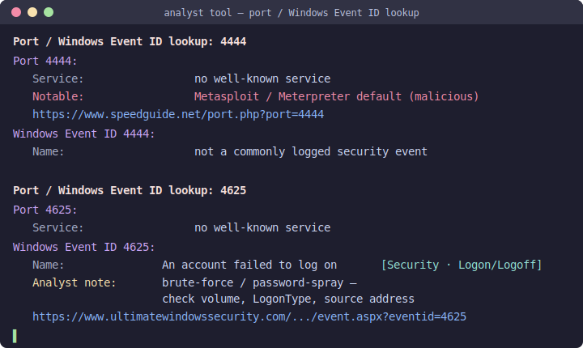
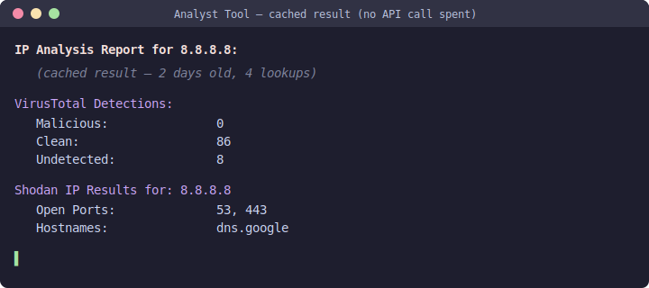
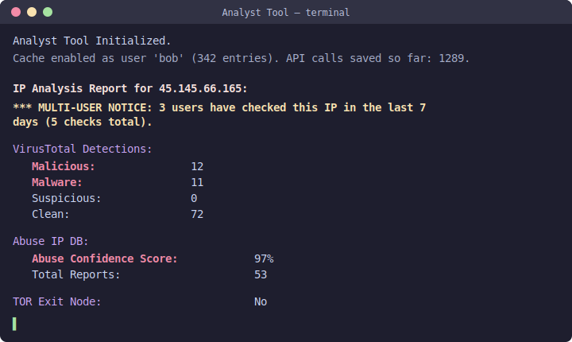
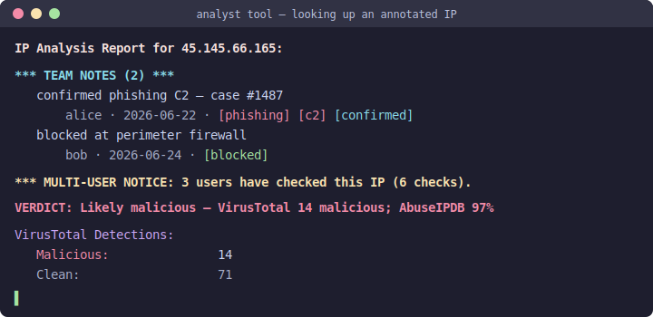

# Analyst Tool — User Guide

A clipboard-driven assistant that automates an analyst's investigation and intelligence
gathering. You copy an indicator (an IP, hash, domain, MITRE ID, etc.) to your clipboard,
and the tool automatically detects what kind of indicator it is, queries every configured
intelligence service in parallel, and prints a formatted report.

The tool is **passive**: it only *looks up* indicators via each service's API. It never
submits anything that would cause an indicator to be actively scanned for the first time.

This guide covers everything the program can do and how to run it in both a **Jupyter
Notebook** and a **terminal**. If you just want to get going, see `QUICKSTART.md`.

---

## Table of contents

1. [How it works](#how-it-works)
2. [Installation](#installation)
3. [Platform prerequisites (clipboard access)](#platform-prerequisites-clipboard-access)
4. [Configuration (`config.ini`)](#configuration-configini)
5. [Running the tool](#running-the-tool)
   - [In a Jupyter Notebook](#in-a-jupyter-notebook)
   - [In a terminal](#in-a-terminal)
   - [Stopping the tool](#stopping-the-tool)
6. [Capabilities — supported indicators](#capabilities--supported-indicators)
7. [Intelligence services in detail](#intelligence-services-in-detail)
8. [SSL verification & the `ssl_verify` fallback](#ssl-verification--the-ssl_verify-fallback)
9. [Result caching (save API calls, local or remote)](#result-caching-save-api-calls-local-or-remote)
10. [Cache files the tool creates](#cache-files-the-tool-creates)
11. [Troubleshooting](#troubleshooting)

---

## How it works

The core is the `analyst()` function. When you start it, it:

1. Reads `config.ini` and initializes every service for which you've provided credentials.
   Services without credentials are skipped gracefully (you'll see a "not configured" note).
2. Loads reference data (MITRE ATT&CK, LOLBAS, LOLDrivers, Tor exit nodes), using local
   cached copies when they're fresh and only re-downloading when stale.
3. Enters a loop that watches your clipboard. The polling interval is adaptive: about
   **1 second** while idle and **3 seconds** right after a lookup fires.
4. Each time the clipboard contents **change**, it runs the new value through a series of
   checks to classify the indicator, then dispatches the matching lookups. For indicators
   that hit multiple services (hashes, domains, URLs, IPs), all API calls run
   **concurrently**, so the total wait is the slowest single service rather than the sum.

You don't type anything into the tool. You simply **copy** an indicator from anywhere
(a SIEM, an email, a log, a spreadsheet) and the report appears in your notebook or terminal.

---

## Installation

You need **Python 3** and the project dependencies.

```bash
# from the project folder
pip install -r requirements.txt
```

The dependencies are: `aiohttp`, `attackcti`, `configparser`, `elasticsearch`, `ipwhois`,
`IPython`, `OTXv2`, `pandas`, `pycti`, `pyperclip`, `requests`, `shodan`, and `validators`.

> Tip: a virtual environment (`python -m venv venv` then activate it) keeps these
> dependencies isolated from the rest of your system.

---

## Platform prerequisites (clipboard access)

The tool reads your clipboard through `pyperclip`. Behavior differs by OS:

| Platform | What you need |
|----------|---------------|
| **Windows** | Works out of the box. |
| **macOS** | Works out of the box. |
| **Linux** | Requires a clipboard backend **and** an active graphical session (X11/Wayland). Install one of: `xclip`, `xsel`, or `wl-clipboard`. For example: `sudo apt-get install xclip` |

On a headless Linux box (no display) the tool will still start and run, but it cannot read
a clipboard, so no lookups will fire. The code handles a missing clipboard backend
gracefully — it won't crash — but you won't get results until a clipboard is available.

Both run modes (Jupyter and terminal) use the same clipboard mechanism, so these
requirements apply equally to both.

---

## Configuration (`config.ini`)

All credentials and options live in `config.ini` in the project folder. **Every API-backed
service is optional.** Fill in only the ones you want to use; the rest are skipped
automatically. The file is organized into sections:

### `[EXCLUSIONS]` — skip domains/URLs

```ini
[EXCLUSIONS]
domains = ultimatewindowssecurity.com, speedguide.net, virustotal.com, ...
```

| Key | Purpose |
|-----|---------|
| `domains` | Comma-separated **domains or IPs** to **not** look up when copied. Matching is by host, so it covers any form: subdomains (`ultimatewindowssecurity.com` also covers `www.ultimatewindowssecurity.com`) and IPs with a port/path (`192.168.1.42` also covers `192.168.1.42:8080` and `192.168.1.42/tool`). Pre-filled with the tool's own reference-link domains so copying a link it printed doesn't trigger a lookup. Leave blank to disable. |

When you copy an excluded domain/URL, the tool prints a one-line
`(Skipped — … is in the exclusion list.)` instead of running a lookup.

This `[EXCLUSIONS]` list is **local** (per machine). There is also a **shared**
exclusion list stored in the cache database — on the remote backend it's
team-wide, and anyone can add/remove it with `>>exclude <domain>` /
`>>exclude-rm` / `>>exclude-list` (or `python annotate.py exclude add/list/rm`).
The effective skip list is the union of the local list and the shared list. See
[NOTE_COMMANDS.md](NOTE_COMMANDS.md).

### `[GENERAL]`

```ini
[GENERAL]
ssl_verify = true
```

| Key | Purpose |
|-----|---------|
| `ssl_verify` | `true` (default) verifies TLS certificates on all outbound calls. `false` enables an insecure fallback — see [SSL verification](#ssl-verification--the-ssl_verify-fallback). Leave it `true` unless you specifically need it. |

### `[CACHE]` — result caching

```ini
[CACHE]
enabled = true
backend = local
freshness_days = 7
db_path = analyst_cache.db
force_prefix = !
purge_days = 0
user =
check_window_days = 7
check_dedup_minutes = 60
host =
port = 5432
dbname =
db_user =
password =
sslmode = prefer
```

| Key | Purpose |
|-----|---------|
| `enabled` | `true` (default) caches lookups; `false` disables caching entirely (every lookup is live). |
| `backend` | `local` uses a SQLite file (single user); `remote` uses a shared PostgreSQL server (a team saves calls together). |
| `freshness_days` | A cached result younger than this many days is reused instead of re-querying the API. Default `7`. |
| `db_path` | SQLite database file (local backend only). |
| `force_prefix` | Copy an indicator with this prefix to force a fresh lookup, e.g. `!8.8.8.8`. Default `!`. |
| `purge_days` | Delete cached entries older than this many days at startup. `0` = never purge. |
| `user` | Identity recorded in the check log (for the "X users have checked this" notice). Blank = your OS login name. Give each analyst a unique value when sharing a remote DB. |
| `check_window_days` | Window for the multi-user notice. Default `7`. |
| `check_dedup_minutes` | A re-check by the **same** user within this many minutes isn't counted again. Default `60`. |
| `command_prefix` | Marks a clipboard line as a notes/tags command rather than an indicator. Default `>>`. See [NOTE_COMMANDS.md](NOTE_COMMANDS.md). |
| `max_notes_shown` | How many team notes to show atop a report before `(+N more)`. Default `5`. |
| `exclusion_refresh_minutes` | How often to re-pull the shared domain-exclusion list from the DB so a teammate's `>>exclude` propagates without a restart. Default `5`. |
| `host`, `port`, `dbname`, `db_user`, `password`, `sslmode` | PostgreSQL connection settings (remote backend only). Note the connection user is `db_user` — `user` above is the analyst identity. |

See [Result caching](#result-caching-save-api-calls-local-or-remote) for full behavior. The remote backend needs the `psycopg2-binary` package (already in `requirements.txt`); the local backend needs nothing beyond the standard library.

### `[ABUSE_IP_DB]` — AbuseIPDB

```ini
[ABUSE_IP_DB]
accept = application/json
key =
```

| Key | Purpose |
|-----|---------|
| `accept` | Response format header (leave as `application/json`). |
| `key` | Your AbuseIPDB API key. Leave blank to disable the module. |

### `[VIRUS_TOTAL]` — VirusTotal

```ini
[VIRUS_TOTAL]
accept = application/json
x-apikey =
user =
```

| Key | Purpose |
|-----|---------|
| `accept` | Response format header. |
| `x-apikey` | Your VirusTotal API key. Leave blank to disable the module. |
| `user` | (Optional) Your VT username. If set, the tool warns you as you approach your daily API quota (50% / 75% / 95% / 100%). |

### `[ALIEN_VAULT_OTX]` — AlienVault OTX

```ini
[ALIEN_VAULT_OTX]
otx_api_key =
server = https://otx.alienvault.com/
```

| Key | Purpose |
|-----|---------|
| `otx_api_key` | Your OTX API key. Leave blank to disable. |
| `server` | OTX server URL (default is correct for the public instance). |

### `[OTX_INTEL]` — trusted OTX pulse authors

```ini
[OTX_INTEL]
intel_list =
```

| Key | Purpose |
|-----|---------|
| `intel_list` | Optional comma-separated list of OTX author usernames you trust. When a looked-up indicator appears in a pulse by one of these authors, the tool highlights it (with extra pulse detail and a "Yes/No" per author). |

### `[OPEN_CTI]` — OpenCTI

```ini
[OPEN_CTI]
opencti_api_url =
opencti_api_token =
opencti_base_url =
```

| Key | Purpose |
|-----|---------|
| `opencti_api_url` | Your OpenCTI GraphQL API URL. |
| `opencti_api_token` | Your OpenCTI API token. Leave blank to disable. |
| `opencti_base_url` | Base URL used to build clickable dashboard links. |

### `[C2LIVE]` — C2 tracking (Elasticsearch)

```ini
[C2LIVE]
c2_live_url =
c2_live_index = c20
```

| Key | Purpose |
|-----|---------|
| `c2_live_url` | URL of your C2Live Elasticsearch instance (e.g. `http://localhost:9200`). Leave blank to disable. |
| `c2_live_index` | The index to query for tracked command-and-control frameworks. |

### `[SHODAN]` — Shodan

```ini
[SHODAN]
shodan_api_key =
```

| Key | Purpose |
|-----|---------|
| `shodan_api_key` | Your Shodan API key. Leave blank to disable. |

### `[CVE]` — CVE / CISA KEV

```ini
[CVE]
nvd_api_key =
```

| Key | Purpose |
|-----|---------|
| `nvd_api_key` | Optional NVD API key. CVE lookups work without one at low volume; a key raises the NVD rate limit. Get one free at nvd.nist.gov. |

### `[WINDOWS_EVENTS]` — Windows Event ID catalog

```ini
[WINDOWS_EVENTS]
feed_url =
```

| Key | Purpose |
|-----|---------|
| `feed_url` | Optional URL to a JSON feed of Windows Event IDs (same schema as the bundled `windows_event_ids.json`) to keep the catalog current. Blank = use the bundled file. Ports are enriched automatically from the IANA registry — no key needed. |

> Reference data services — **WhoIs**, **Tor / VPN / datacenter checks**,
> **DNS + crt.sh**, **CVE / CISA KEV**, **MITRE ATT&CK**, **LOLBAS**, and
> **LOLDrivers** — require **no API keys** and work automatically (the optional
> NVD key only raises a rate limit).

---

## Running the tool

The exact same engine runs in both modes. The only difference is the `terminal` argument,
which controls how MITRE ATT&CK output is rendered:

- `analyst(terminal=0)` — **Jupyter mode (default).** MITRE descriptions render as rich
  Markdown in the notebook output.
- `analyst(terminal=1)` — **terminal mode.** MITRE descriptions print as plain text.

### In a Jupyter Notebook

1. Launch Jupyter from the project folder (`jupyter notebook` or `jupyter lab`).
2. Open **`Analyst Tool.ipynb`**.
3. Run the cell containing:

   ```python
   from analyst import *
   analyst()
   ```

   (`analyst()` defaults to `terminal=0`, the correct setting for notebooks.)

4. You'll see configuration messages confirming which modules are active, ending with
   `Analyst Tool Initialized.`
5. Now copy any supported indicator to your clipboard. The report appears in the cell's
   output area. Copy the next indicator and the next report follows.

The cell keeps running (it's a live loop) — that's expected.

### In a terminal

Run the provided launcher, which calls `analyst(terminal=1)` for you:

```bash
python analyst_tool.py
```

After the initialization messages, copy an indicator to your clipboard and the report
prints to the terminal. Keep copying indicators to keep getting reports.

> You can also start an interactive Python session and call it directly:
> ```python
> from analyst import *
> analyst(terminal=1)
> ```

### Stopping the tool

Because the tool runs a continuous monitoring loop:

- **Jupyter:** interrupt the kernel (the ■ "stop" button, or `Kernel → Interrupt`).
- **Terminal:** press `Ctrl+C`.

---

## Capabilities — supported indicators

Copy any of the following to your clipboard and the tool detects and reports on it
automatically. Detection is evaluated in this order (the first match wins):

| # | Indicator | What triggers it | What you get |
|---|-----------|------------------|--------------|
| 1 | **File hash** | MD5 (32), SHA1 (40), or SHA256 (64) hex characters | VirusTotal reputation + threat classification + file info, OpenCTI record, and OTX hash report (contacted domains/IPs), run in parallel |
| 2 | **Port or Windows Event ID** | A 1–5 digit number | Both interpretations, enriched: the **port's** service (IANA registry) and any malware/C2 association, and the **Windows Event ID's** name, log, category and an analyst note — each with its SpeedGuide / Ultimate Windows Security link |
| 3 | **LOLBAS binary** | A filename ending in a known LOLBAS extension (e.g. `cmd.exe`) | Name, description, full path(s), example commands with use case/privileges/MITRE IDs, IOCs, and the LOLBAS URL |
| 4 | **LOLDriver** | A filename matching a known malicious/vulnerable driver | Name, description, MITRE ID, command/OS/privilege/use-case, resources, and the LOLDrivers URL |
| 5 | **Domain** | A valid domain name | VirusTotal domain report (detections, WHOIS creation date, certificate info), OpenCTI record, and OTX domain report, in parallel |
| 6 | **URL** | A valid URL | VirusTotal URL report (detections, tags, threat names, submission dates), OpenCTI record, and OTX URL report, in parallel. URLs are displayed "defanged" (e.g. `hxxps://`) |
| 7 | **MITRE ATT&CK ID** | A tactic `TA####`, technique `T####`, or sub-technique `T####.###` | The tactic/technique/sub-technique name, ATT&CK URL, description, and detection guidance. Renders as Markdown in Jupyter, plain text in the terminal |
| 8 | **Epoch timestamp** | A 10–16 digit Unix timestamp (optionally with a decimal) | The human-readable date/time |
| 9 | **OTX Pulse ID** | A 24-character hex pulse ID | Full pulse details: author, name, TLP, created/modified dates, tags, malware families, description, and references |
| 10 | **IPv6 address** | An IPv6-formatted address | WhoIs information (organization, CIDR, range, country, associated emails) |
| 11 | **Private IPv4** | An RFC1918 address (e.g. `10.0.0.5`, `192.168.1.1`) | A note that it's a private/RFC1918 address (no external lookups) |
| 12 | **Public IPv4** | Any other valid IPv4 address | A full IP analysis report — see below |
| 13 | **CVE id** | `CVE-2021-44228` | NVD details (CVSS, severity, description) + whether it's on the CISA Known Exploited Vulnerabilities list |

Two behaviours apply to all of the above:

- **Refang on input** — defanged indicators copied from reports (e.g.
  `hxxps://evil[.]com`, `8[.]8[.]8[.]8`, `bad(dot)com`, `user[at]evil[.]com`) are
  automatically re-fanged before detection, so they're recognized normally.
- **One-line verdict** — IP, hash, domain and URL reports open with a single
  summary line, e.g. `VERDICT: Likely malicious — VirusTotal 12 malicious;
  AbuseIPDB 97%; OpenCTI 90/100; VPN egress`. It weighs VirusTotal, AbuseIPDB,
  Shodan (Cobalt Strike) and your OpenCTI malicious score, with Tor/VPN/datacenter
  as context, so you can triage at a glance before reading the detail.

Example of an enriched number lookup (shown as both a port and an Event ID):



### Public IP analysis (the most comprehensive report)

When you copy a public IPv4 address, the tool fans out to every enabled service at once:

- **VirusTotal** — malicious/suspicious/phishing/malware/spam detection counts.
- **Shodan** — last-seen date, open ports, domains, hostnames, and **Cobalt Strike beacon
  detection** (including beacon config such as port, sleep time, watermark, and spawn-to
  settings when available).
- **WhoIs** — organization, CIDR, IP range, country, and associated abuse emails.
- **Tor exit-node check** — whether the IP is a known Tor exit node.
- **VPN-provider check** — whether the IP falls within a known commercial VPN
  network (X4BNet list, no API key). A match is highlighted in orange.
- **Datacenter/hosting check** — whether the IP is in known datacenter/hosting
  space (X4BNet list, no API key). Useful since most VPNs/proxies are hosted.
- **AbuseIPDB** — abuse confidence score, total reports, last reported date, distinct
  reporters, usage type, and domain.
- **AlienVault OTX** — related pulse count, reputation, passive DNS, and trusted-author
  highlights.
- **OpenCTI** — active/revoked status, malicious score, confidence, source, tags, and TLP.
- **C2Live** — whether the IP appears in your tracked command-and-control data, and which
  frameworks, with first/last seen dates.

---

## Intelligence services in detail

| Service | Needs a key? | Used for | Notes |
|---------|:-----------:|----------|-------|
| **VirusTotal** | Yes | IPs, domains, URLs, hashes | Optional `user` enables daily-quota warnings |
| **AbuseIPDB** | Yes | IPs | 90-day report window; warns near the 1000/day limit |
| **AlienVault OTX** | Yes | IPs, domains, URLs, hashes, pulses | `OTX_INTEL` list highlights trusted authors |
| **OpenCTI** | Yes | IPs, domains, URLs, hashes | Builds clickable dashboard links |
| **Shodan** | Yes | IPs | Includes Cobalt Strike beacon detection |
| **C2Live** | Yes (self-hosted ES) | IPs | Queries your own Elasticsearch C2 index |
| **WhoIs** | No | IPv4 & IPv6 | Via `ipwhois`; no API key required |
| **Tor check** | No | IPs | Exit-node list cached ~45 minutes |
| **VPN check** | No | IPs (IPv4) | X4BNet VPN ranges, cached ~24 hours; heuristic |
| **Datacenter check** | No | IPs (IPv4) | X4BNet datacenter ranges, cached ~24 hours |
| **DNS + crt.sh** | No | Domains | A/AAAA + PTR (stdlib), MX/NS (if dnspython), subdomains from Certificate Transparency |
| **CVE / CISA KEV** | No (optional NVD key) | CVE ids | NVD details + CISA Known Exploited Vulnerabilities status |
| **Ports / Event IDs** | No | numbers | IANA port registry (cached) + bundled malware-port and Windows Event ID catalogs |
| **MITRE ATT&CK** | No | Tactic/technique IDs | Local JSON cache refreshed every 90 days |
| **LOLBAS** | No | Living-off-the-land binaries | JSON cache refreshed every 14 days |
| **LOLDrivers** | No | Malicious/vulnerable drivers | JSON cache refreshed every 14 days |

If a service has no credentials in `config.ini`, the corresponding section of a report
simply notes that it's "not configured" rather than failing.

---

## SSL verification & the `ssl_verify` fallback

By default (`ssl_verify = true`) the tool verifies TLS certificates on every outbound API
call, which is the secure and recommended setting.

Some environments — corporate networks with a TLS-intercepting proxy, or services using
self-signed certificates — cause certificate verification to fail. For those cases you can
set:

```ini
[GENERAL]
ssl_verify = false
```

With the flag set to `false`:

- **`requests`-based lookups** (VirusTotal, AbuseIPDB, LOLBAS/LOLDrivers downloads, Tor
  list) first try a verified connection and, **only if it raises an SSL error**, retry that
  request once with verification disabled.
- **API clients** (OTX, Shodan, OpenCTI, Elasticsearch) are constructed with verification
  disabled.
- The repetitive "insecure request" warning is silenced so it doesn't flood the output.

> ⚠️ Disabling verification removes protection against man-in-the-middle attacks. Use it
> only when you trust the network path (e.g. a known corporate proxy). Leave it `true`
> otherwise. With the flag at its default `true`, behavior is exactly as if this option
> did not exist.

---

## Result caching (save API calls, local or remote)

To conserve limited API quotas, the tool can cache the result of each external,
rate-limited service and reuse it instead of spending another API call. This is
controlled by the `[CACHE]` section and is **on by default with the local
backend**.

### Which services are cached

VirusTotal, AbuseIPDB, Shodan, and AlienVault OTX — the external, rate-limited
APIs. OpenCTI and C2Live (self-hosted), WhoIs, Tor, MITRE, and LOLBAS/LOLDrivers
are not cached this way (they're either local, self-hosted, or already cached on
disk).

### How it works

For each cached service, a result is stored per indicator (IP, hash, domain, or
URL) together with a timestamp and usage counters:

1. When you copy an indicator, the tool checks the database first for each
   applicable service.
2. If a stored result exists and is **younger than `freshness_days`** (default 7),
   it's replayed — identical to a live result, prefixed with a small
   `(cached result — N days old, M lookups)` note — and **no API call is made**.
3. If there's no entry or it's stale, the tool does the live API call, shows the
   result, and saves it for next time.

Because the cache key is the indicator plus the service, a fresh AbuseIPDB entry
can be served from cache while VirusTotal is queried live, for example.

### Local vs. remote

- **`backend = local`** (default): a single SQLite file (`db_path`,
  `analyst_cache.db` by default). Zero setup; ideal for one analyst. Every
  re-lookup within the freshness window is a saved API call.
- **`backend = remote`**: a shared PostgreSQL database. Multiple analysts point
  at the same server, so a lookup one person already paid for is free for
  everyone else. Set `host`, `port`, `dbname`, `user`, `password`, and `sslmode`.

The schema is created automatically on first run for either backend.

### Usage tracking

Every entry records `lookup_count` (total requests), `cache_hits` (times served
from cache = **API calls saved**), and `api_calls` (live calls made). At startup
the tool prints a one-line summary, e.g. `Cache enabled as user 'bob' (128
entries). API calls saved so far: 412.`

A cached result looks identical to a live one, with a small dim marker:



### Multi-user check tracking ("X users have checked this")

The database also logs **who** looked up each indicator. When more than one
analyst — or the same analyst in separate sessions more than
`check_dedup_minutes` apart — has checked the same indicator within
`check_window_days`, the tool prints a heads-up notice at the top of the report:



How the counting works:

- Each check is logged with the analyst's identity (the `[CACHE] user` value, or
  the OS login name if blank) and a timestamp.
- A repeat check of the same indicator by the **same** user within
  `check_dedup_minutes` (default 60) is **not** counted again — this stops rapid
  re-copies of the same clipboard value from inflating the number.
- The same user checking again **after** that window counts as a new check.
- Over the last `check_window_days` (default 7), if there is more than one
  qualifying check, the notice appears. If two or more **distinct** users are
  involved it reads `N users have checked this <type> …`; if it's one user across
  multiple sessions it reads `This <type> has been checked N times …`.

This is most valuable with the **remote** backend: everyone on the team shares one
database, so you immediately see when a colleague is already investigating the
same indicator. Give each analyst a distinct `[CACHE] user` so the counts are
meaningful.

### Shared annotations & tags

Analysts can attach durable **notes and tags** to an indicator. They're stored in
the same database (team-wide on the remote backend) and print automatically in a
`*** TEAM NOTES ***` block at the very top of the next lookup of that indicator:



Lookups are unchanged — only clipboard lines starting with the `command_prefix`
(default `>>`) are treated as commands:

```
>>note 45.145.66.165 confirmed phishing C2, case #1487 #phishing #c2
>>note 45.145.66.165          (the tool then prompts you to type the note)
>>tag 45.145.66.165 phishing c2
>>note-rm 45.145.66.165       (removes your own notes)
```

A bare `>>note` (or `>>note <text>`) attaches to your **last** lookup. There's also
a `python annotate.py add/list/rm` CLI for clipboard-free entry. Tags are
colour-coded (malicious-type tags red, `fp`/`benign` green). Full reference with
examples: [NOTE_COMMANDS.md](NOTE_COMMANDS.md).

### Forcing a fresh lookup

To bypass the cache for a single indicator — for example to confirm a result
hasn't changed — copy it with the `force_prefix` (default `!`) in front, e.g.
`!8.8.8.8`. That lookup goes live and refreshes the stored entry.

### Resilience

If a live API call fails (network/outage) but an older cached result exists, the
tool falls back to that result and labels it `(stale cached result — live lookup
failed)` rather than showing nothing. If the database itself can't be reached,
caching simply turns off and all lookups run live — the tool never breaks because
of the cache.

### Housekeeping

Set `purge_days` to a non-zero value to delete entries older than that many days
at startup. Leave it `0` to keep everything (stale entries are simply re-queried
when looked up, so unbounded growth is the only downside).

---

## Cache files the tool creates

To stay fast and reduce network calls, the tool writes a few cache files into the project
folder. These are created/refreshed automatically — you don't need to manage them:

| File | Contents | Refresh interval |
|------|----------|------------------|
| `mitre_techniques.json` | MITRE ATT&CK techniques | 90 days |
| `enterprise_tactics.json` | MITRE ATT&CK tactics | 90 days |
| `lolbas.json` | LOLBAS project data | 14 days |
| `drivers.json` | LOLDrivers data | 14 days |
| `tor_exit_nodes.txt` | Current Tor exit-node IPs | ~45 minutes |
| `vpn_networks.txt` | Known VPN provider IP ranges (X4BNet) | ~24 hours |
| `datacenter_networks.txt` | Known datacenter/hosting IP ranges (X4BNet) | ~24 hours |
| `cisa_kev.json` | CISA Known Exploited Vulnerabilities catalog | ~24 hours |
| `iana_ports.csv` | IANA service-name/port registry | ~30 days |
| `analyst_cache.db` | Cached service results + usage counters + per-user check log (local backend) | Per-entry, `freshness_days` (default 7) |

If a refresh download fails, the tool falls back to the existing cached copy so it keeps
working offline or during a transient outage.

---

## Troubleshooting

**Nothing happens when I copy an indicator.**
The tool only reacts when the clipboard *changes*. Copy the value again, or copy something
else first and then your indicator. Also confirm you saw `Analyst Tool Initialized.` at
startup.

**On Linux it starts but never reports anything.**
You likely don't have a clipboard backend or a graphical session. Install `xclip`, `xsel`,
or `wl-clipboard`, and run from within an X11/Wayland session.

**I get SSL / certificate errors.**
You're probably behind a TLS-intercepting proxy or talking to a self-signed service. Set
`ssl_verify = false` under `[GENERAL]` in `config.ini` (see above), understanding the
security trade-off.

**A service shows "not configured."**
That service has no API key in `config.ini`. Add the key to enable it, or ignore the
message if you don't use that service.

**I'm approaching or hit my API quota.**
For VirusTotal, set `user` under `[VIRUS_TOTAL]` to get proactive quota warnings. AbuseIPDB
warns automatically as you near its daily limit.

**A domain like `first.last` triggered a lookup.**
Domain detection can produce false positives on dotted strings. This is expected; just
ignore the report.

**The notebook cell or terminal won't stop.**
That's the monitoring loop. Interrupt the Jupyter kernel, or press `Ctrl+C` in the terminal.

**A result looks out of date / I want to re-query.**
The result is cached and still within the freshness window. Copy the indicator with
the force prefix (default `!`), e.g. `!8.8.8.8`, to force a fresh lookup, or lower
`freshness_days` in `config.ini`.

**The remote cache won't connect.**
Confirm `psycopg2-binary` is installed and that `host`, `port`, `dbname`, `user`,
`password`, and `sslmode` under `[CACHE]` are correct and the server is reachable. If
it can't connect, the tool prints a notice and falls back to live lookups (no caching).

**I want to turn caching off.**
Set `enabled = false` under `[CACHE]`. Every lookup will then be live, exactly as
before the cache existed.
